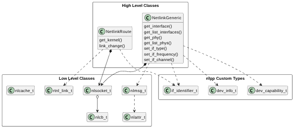

# nlpp library
This library is a modern C++ wrapper of the well-known [Netlink Protocol Library Suite (libnl)](https://www.infradead.org/~tgr/libnl/) written in C. Made to learn. Made for fun.

The library aims to simplify the access to the Linux kernel interfaces available via the Netlink protocol using a more modern approach.

## Library Overview

Low Level Classes wrap some fundamental libnl data types, like sockets, messages, attributes and callbacks.

High Level Classes provide more generic functionality, such as obtaining device info/capabilities, putting link up/down, setting device mode and more.

### Netlink Generic

`NetlinkGeneric` methods are mapped to some `iw` commands:

- `NetlinkGeneric::get_interface()` → `iw dev <devname> info`: get information about an interface
- `NetlinkGeneric::get_list_interfaces()` → `iw dev`: get information about all interfaces
- `NetlinkGeneric::get_phy()` → `iw phy <phyname> info`: get capabilities about a device
- `NetlinkGeneric::get_list_phys()` → `iw phy`
- `NetlinkGeneric::set_if_type()` → `iw dev <devname> set type <type>`: set device type
- `NetlinkGeneric::set_if_frequency()` → `iw dev <devname> set freq <freq>`: set device frequency
- `NetlinkGeneric::set_if_channel()` → `iw dev <devname> set channel <channel>`: set device channel frequency