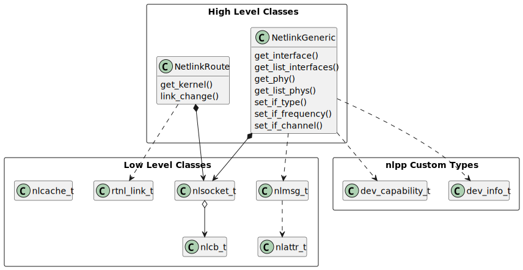

# nlpp

This library is a modern C++ wrapper of the well-known [Netlink Protocol Library Suite (libnl)](https://www.infradead.org/~tgr/libnl/) written in C. Made to learn. Made for fun.

The library aims to simplify the access to the Linux kernel interfaces available via the Netlink protocol by taking a more modern approach.

## Library Overview

Low Level Classes wrap some fundamental libnl data types, like sockets, messages, attributes and callbacks.

High Level Classes provide more generic functionality, such as obtaining device info/capabilities, putting link up/down, setting device mode and more.

### Netlink Generic

`NetlinkGeneric` is the most useful class and its methods are mapped to some `iw` commands:

| Method                                  | Command                                  | Description                          |
| ----------------------------------------| -----------------------------------------| -------------------------------------|
| `NetlinkGeneric::get_interface()`       | `iw dev <devname> info`                  | Get information about an interface   |
| `NetlinkGeneric::get_list_interfaces()` | `iw dev`                                 | Get information about all interfaces |
| `NetlinkGeneric::get_phy()`             | `iw phy <phyname> info`                  | Get capabilities about a device      |
| `NetlinkGeneric::get_list_phys()`       | `iw phy`                                 | Get capabilities about all devices   |
| `NetlinkGeneric::set_if_type()`         | `iw dev <devname> set type <type>`       | Set device type                      |
| `NetlinkGeneric::set_if_frequency()`    | `iw dev <devname> set freq <frequency>`  | Set device frequency                 |
| `NetlinkGeneric::set_if_channel()`      | `iw dev <devname> set channel <channel>` | Set device channel frequency         |

## Usage

You can find usage examples in the `test/` directory.

The utility class `WifiDevice` demonstrates most of this library functionalities and also provides usage examples. Use it as a reference.
